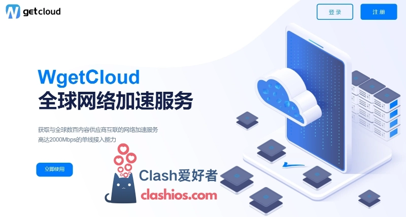

# go4sharing.github.io

Clash 爱好者推荐的翻墙机场梯子都是有一定知名度的大机场，或者说是一线机场、主流机场、优质机场。大机场一般技术更为成熟，线路比较稳定，跑路的风险也低，同时也能很好的支持解锁 Netflix、Disney+ 流媒体，提供 ChatGPT 解锁访问等等。

机场采用专用的穿墙技术而非传统的 VPN 协议，辅以规则模式分流，相比 ExpressVPN 等傻瓜式一键 VPN 更为智能，稳定性和速度表现都更好，能够最大程度地满足大家的科学上网需求。可以说机场是当前最适合大多数人的翻墙方式。

机场的使用方式十分简单，注册账号购买订阅并搭配第三方软件（Clash、Shadowrocket、V2rayN、V2rayNG、Surge、Quantumult X、Stash 等）使用，用户可参照文档一步一步进行操作。Clash 爱好者整理的各平台翻墙软件安装地址：Clash 下载

好用的 Clash 机场推荐（2025 年持续更新中）
Clash爱好者精选好用的机场，排名不分先后顺序，罗列了机场支持的协议、线路特点、套餐价格、支持的国家和地区及其他一些特性，每个机场都有撰写详细的评测报告，请按需择优，多体验几家对比对比，希望每一位科学上网爱好者都能找到适合自己的机场。

✍️写在前面

付费机场并非VPN，但付费机场比VPN更适合国内科学上网的环境。诸如 ExpressVPN、NordVPN、SurfShark 之流仅适用于海外环境，到国内这种对VPN协议封锁严重的情况就「摆烂」了，一般科学上网者都折腾不来，不建议国内大部分翻墙的朋友用这些VPN。
机场测速是一个很好的参考要素，但是仅仅是我们观测机场表现的要素之一，不要迷信机场测速，跑多快不重要，机场运营靠谱，节点日常使用表现稳定才会有好的体验。追求机场节点跑满带宽的都是「伪需求」。
由于开设翻墙机场的门槛低，市面上有很多小机场不断冒出来，但大多小机场都不太靠谱，很容易跑路，不建议用那些来路不明的机场，特别是一些价格超便宜的机场，往往有更高的跑路风险，同时其节点的日常使用体验也会很差。建议优先选择大机场。
建议翻墙者尽量选择月付套餐，他人的测速和评价参考意义有限，一定要亲自试用再下判断，不要一来就选择包年套餐，即便是大机场也建议月付，RixCloud、速蛙云、Blinkload 的教训应该足够深刻了。另外一定要有备用的翻墙方案，避免出现没有梯子可用的情况的发生。
建议使用机场推荐的客户端，一般都比较推荐 Clash，使用非推荐客户端可能会遇到适配不佳的问题。机场定制客户端只建议新手小白使用，熟手还是更推荐直接使用 Clash 图形化客户端。iOS 系统建议自己注册海外 ID，使用付费软件，以获得稳定体验。
翻墙（科学上网）后也请对自己的一言一行负责任，墙外并非法外之地。请严格遵守本地及节点所在地区的法律法规，不要以身试法，避免给自己和他人带来不必要的麻烦。

